# Runtime flows

Every runtime flow of the system, as sequence diagrams that match the code. Update this file
whenever a flow changes. GitHub renders the diagrams; locally, any Markdown preview with
Mermaid support works.

Contents

- [Components](#components)
- Part 0, foundation: [Startup and shutdown](#1-startup-and-shutdown) · [Request pipeline](#2-request-pipeline) · [Core API calls RAG over gRPC](#3-core-api-calls-rag-over-grpc)
- Part 1, accounts and workspaces: [Register](#4-register) · [Login](#5-login) · [Authenticated request](#6-authenticated-request) · [Refresh tokens](#7-refresh-tokens) · [Logout](#8-logout) · [Create workspace](#9-create-workspace) · [Invite a member](#10-invite-a-member) · [Accept an invitation](#11-accept-an-invitation) · [Change role or remove a member](#12-change-role-or-remove-a-member)
- Part 2, document library: [Upload](#13-upload-a-document) · [Content check](#14-content-check-background) · [List](#15-list-documents) · [Download](#16-download-a-document) · [Share and unshare](#17-share-and-unshare) · [Delete](#18-delete-a-document) · [Abandoned uploads](#19-abandoned-upload-sweep) · [Outbox worker](#20-outbox-worker)

## Components

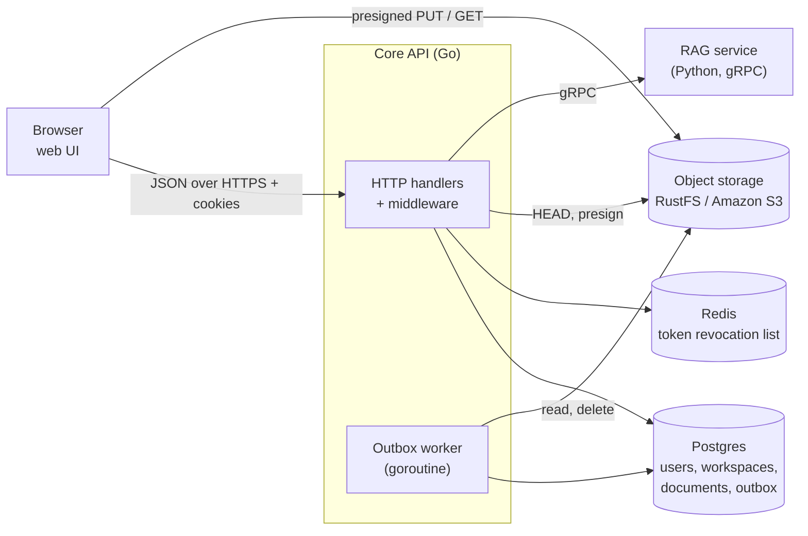
```mermaid
flowchart LR
    Browser["Browser<br/>web UI"]
    subgraph API["Core API (Go)"]
        HTTP["HTTP handlers<br/>+ middleware"]
        Worker["Outbox worker<br/>(goroutine)"]
    end
    RAG["RAG service<br/>(Python, gRPC)"]
    PG[("Postgres<br/>users, workspaces,<br/>documents, outbox")]
    Redis[("Redis<br/>token revocation list")]
    S3[("Object storage<br/>RustFS / Amazon S3")]

    Browser -->|"JSON over HTTPS + cookies"| HTTP
    Browser -->|"presigned PUT / GET"| S3
    HTTP --> PG
    HTTP --> Redis
    HTTP -->|"HEAD, presign"| S3
    HTTP -->|"gRPC"| RAG
    Worker --> PG
    Worker -->|"read, delete"| S3
```

---

## Part 0: foundation

### 1. Startup and shutdown

`api/cmd/api/main.go`. Configuration is validated before anything starts; every resource is
closed in reverse order on shutdown. A second signal kills the process at once.

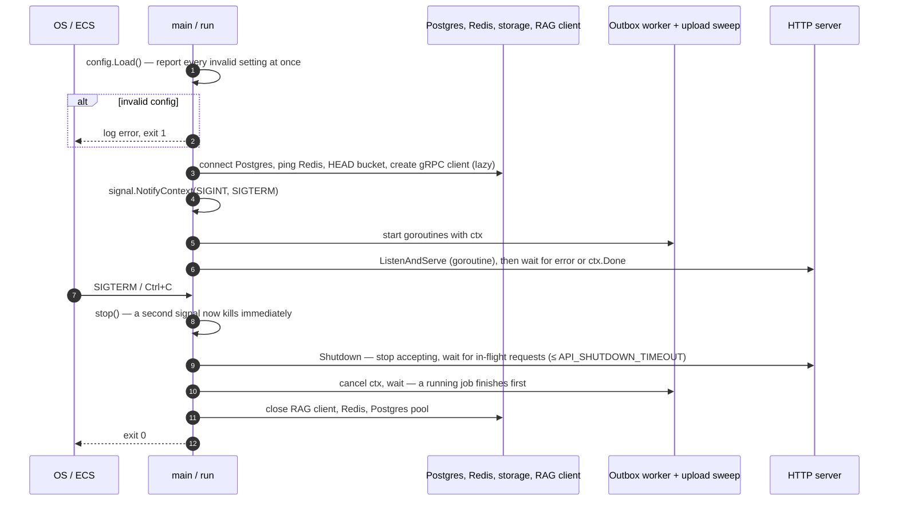
```mermaid
sequenceDiagram
    autonumber
    participant OS as OS / ECS
    participant Main as main / run
    participant Deps as Postgres, Redis, storage, RAG client
    participant BG as Outbox worker + upload sweep
    participant HTTP as HTTP server

    Main->>Main: config.Load() — report every invalid setting at once
    alt invalid config
        Main-->>OS: log error, exit 1
    end
    Main->>Deps: connect Postgres, ping Redis, HEAD bucket, create gRPC client (lazy)
    Main->>Main: signal.NotifyContext(SIGINT, SIGTERM)
    Main->>BG: start goroutines with ctx
    Main->>HTTP: ListenAndServe (goroutine), then wait for error or ctx.Done
    OS->>Main: SIGTERM / Ctrl+C
    Main->>Main: stop() — a second signal now kills immediately
    Main->>HTTP: Shutdown — stop accepting, wait for in-flight requests (≤ API_SHUTDOWN_TIMEOUT)
    Main->>BG: cancel ctx, wait — a running job finishes first
    Main->>Deps: close RAG client, Redis, Postgres pool
    Main-->>OS: exit 0
```

### 2. Request pipeline

`api/cmd/api/routes.go`, `api/internal/platform/httpserver/middleware.go`. Every request goes
through the same three middleware before routing.

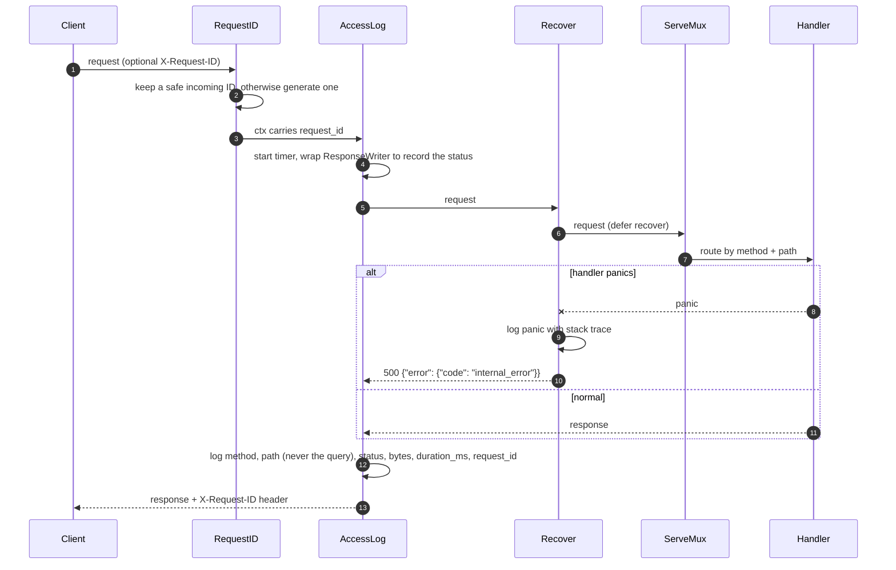
```mermaid
sequenceDiagram
    autonumber
    participant C as Client
    participant RID as RequestID
    participant LOG as AccessLog
    participant REC as Recover
    participant MUX as ServeMux
    participant H as Handler

    C->>RID: request (optional X-Request-ID)
    RID->>RID: keep a safe incoming ID, otherwise generate one
    RID->>LOG: ctx carries request_id
    LOG->>LOG: start timer, wrap ResponseWriter to record the status
    LOG->>REC: request
    REC->>MUX: request (defer recover)
    MUX->>H: route by method + path
    alt handler panics
        H--xREC: panic
        REC->>REC: log panic with stack trace
        REC-->>LOG: 500 {"error": {"code": "internal_error"}}
    else normal
        H-->>LOG: response
    end
    LOG->>LOG: log method, path (never the query), status, bytes, duration_ms, request_id
    LOG-->>C: response + X-Request-ID header
```

### 3. Core API calls RAG over gRPC

`api/internal/platform/ragclient`, `rag/src/rag/server.py`. Debug route only
(`API_ENABLE_DEBUG_ROUTES=true`); real RAG calls arrive in Part 4.

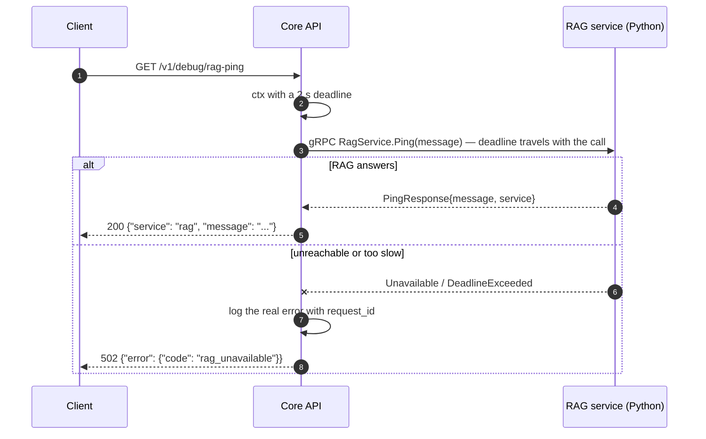
```mermaid
sequenceDiagram
    autonumber
    participant C as Client
    participant API as Core API
    participant RAG as RAG service (Python)

    C->>API: GET /v1/debug/rag-ping
    API->>API: ctx with a 2 s deadline
    API->>RAG: gRPC RagService.Ping(message) — deadline travels with the call
    alt RAG answers
        RAG-->>API: PingResponse{message, service}
        API-->>C: 200 {"service": "rag", "message": "..."}
    else unreachable or too slow
        RAG--xAPI: Unavailable / DeadlineExceeded
        API->>API: log the real error with request_id
        API-->>C: 502 {"error": {"code": "rag_unavailable"}}
    end
```

---

## Part 1: accounts and workspaces

### 4. Register

`api/internal/identity/app/service.go` (`Register`). Registering does not log in; the UI calls
login right after.

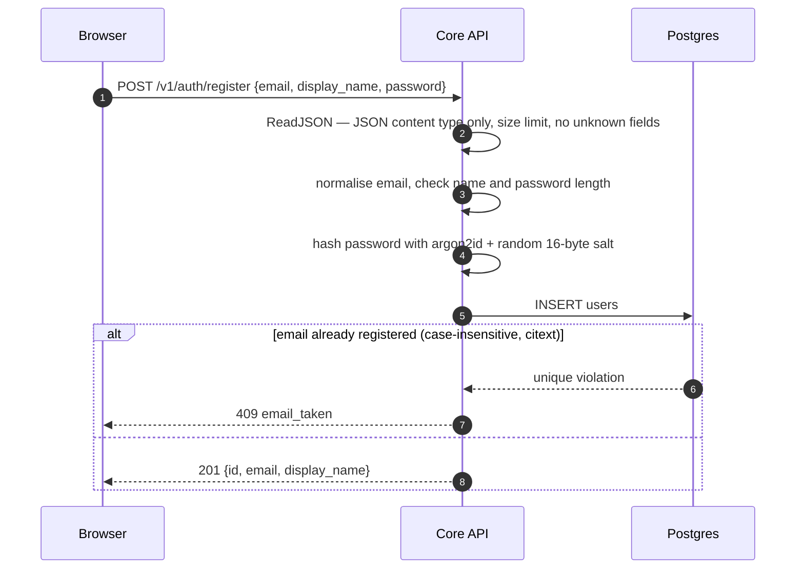
```mermaid
sequenceDiagram
    autonumber
    participant B as Browser
    participant API as Core API
    participant PG as Postgres

    B->>API: POST /v1/auth/register {email, display_name, password}
    API->>API: ReadJSON — JSON content type only, size limit, no unknown fields
    API->>API: normalise email, check name and password length
    API->>API: hash password with argon2id + random 16-byte salt
    API->>PG: INSERT users
    alt email already registered (case-insensitive, citext)
        PG-->>API: unique violation
        API-->>B: 409 email_taken
    else
        API-->>B: 201 {id, email, display_name}
    end
```

### 5. Login

`identity/app/service.go` (`Login`), `identity/app/tokens.go`, ADR 0002.

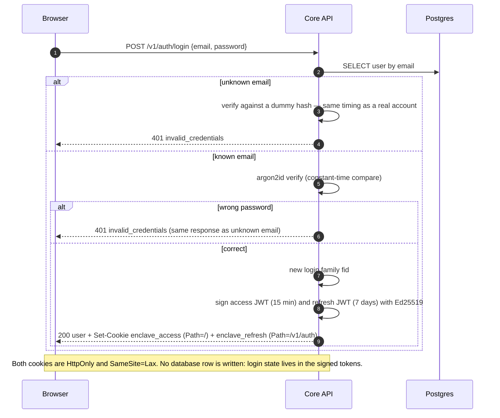
```mermaid
sequenceDiagram
    autonumber
    participant B as Browser
    participant API as Core API
    participant PG as Postgres

    B->>API: POST /v1/auth/login {email, password}
    API->>PG: SELECT user by email
    alt unknown email
        API->>API: verify against a dummy hash — same timing as a real account
        API-->>B: 401 invalid_credentials
    else known email
        API->>API: argon2id verify (constant-time compare)
        alt wrong password
            API-->>B: 401 invalid_credentials (same response as unknown email)
        else correct
            API->>API: new login family fid
            API->>API: sign access JWT (15 min) and refresh JWT (7 days) with Ed25519
            API-->>B: 200 user + Set-Cookie enclave_access (Path=/) + enclave_refresh (Path=/v1/auth)
        end
    end
    Note over B,API: Both cookies are HttpOnly and SameSite=Lax. No database row is written: login state lives in the signed tokens.
```

### 6. Authenticated request

`identity/transport/http.go` (`RequireAuth`), `workspace/app/service.go`. Identity comes from
the token; permissions always come from Postgres.

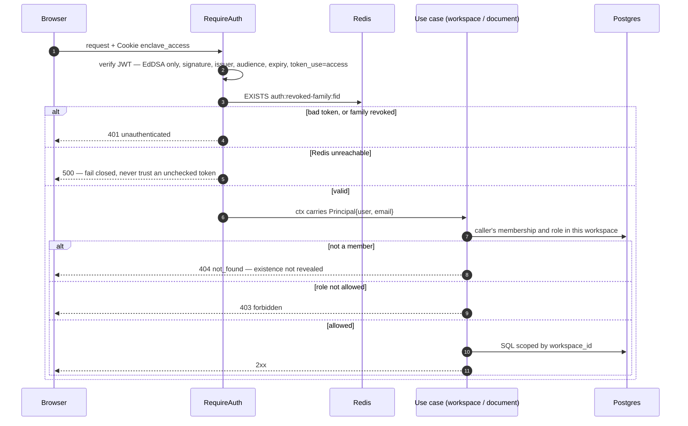
```mermaid
sequenceDiagram
    autonumber
    participant B as Browser
    participant MW as RequireAuth
    participant R as Redis
    participant APP as Use case (workspace / document)
    participant PG as Postgres

    B->>MW: request + Cookie enclave_access
    MW->>MW: verify JWT — EdDSA only, signature, issuer, audience, expiry, token_use=access
    MW->>R: EXISTS auth:revoked-family:fid
    alt bad token, or family revoked
        MW-->>B: 401 unauthenticated
    else Redis unreachable
        MW-->>B: 500 — fail closed, never trust an unchecked token
    else valid
        MW->>APP: ctx carries Principal{user, email}
        APP->>PG: caller's membership and role in this workspace
        alt not a member
            APP-->>B: 404 not_found — existence not revealed
        else role not allowed
            APP-->>B: 403 forbidden
        else allowed
            APP->>PG: SQL scoped by workspace_id
            APP-->>B: 2xx
        end
    end
```

### 7. Refresh tokens

`identity/app/service.go` (`Refresh`), `identity/infra/redis.go`. The UI calls this when any
request returns 401, then retries once.

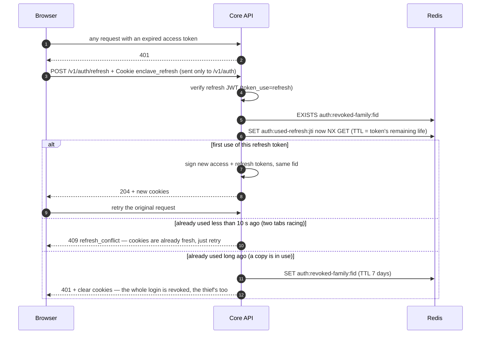
```mermaid
sequenceDiagram
    autonumber
    participant B as Browser
    participant API as Core API
    participant R as Redis

    B->>API: any request with an expired access token
    API-->>B: 401
    B->>API: POST /v1/auth/refresh + Cookie enclave_refresh (sent only to /v1/auth)
    API->>API: verify refresh JWT (token_use=refresh)
    API->>R: EXISTS auth:revoked-family:fid
    API->>R: SET auth:used-refresh:jti now NX GET (TTL = token's remaining life)
    alt first use of this refresh token
        API->>API: sign new access + refresh tokens, same fid
        API-->>B: 204 + new cookies
        B->>API: retry the original request
    else already used less than 10 s ago (two tabs racing)
        API-->>B: 409 refresh_conflict — cookies are already fresh, just retry
    else already used long ago (a copy is in use)
        API->>R: SET auth:revoked-family:fid (TTL 7 days)
        API-->>B: 401 + clear cookies — the whole login is revoked, the thief's too
    end
```

### 8. Logout

`identity/app/service.go` (`Logout`). Works even with an expired access token.

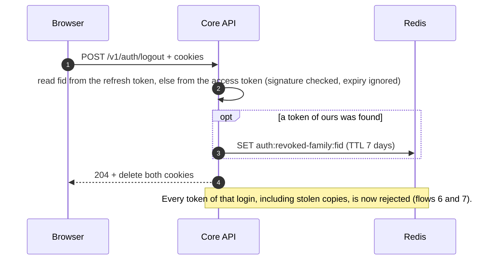
```mermaid
sequenceDiagram
    autonumber
    participant B as Browser
    participant API as Core API
    participant R as Redis

    B->>API: POST /v1/auth/logout + cookies
    API->>API: read fid from the refresh token, else from the access token (signature checked, expiry ignored)
    opt a token of ours was found
        API->>R: SET auth:revoked-family:fid (TTL 7 days)
    end
    API-->>B: 204 + delete both cookies
    Note over API,R: Every token of that login, including stolen copies, is now rejected (flows 6 and 7).
```

### 9. Create workspace

`workspace/app/service.go` (`CreateWorkspace`), `workspace/infra/postgres.go`.

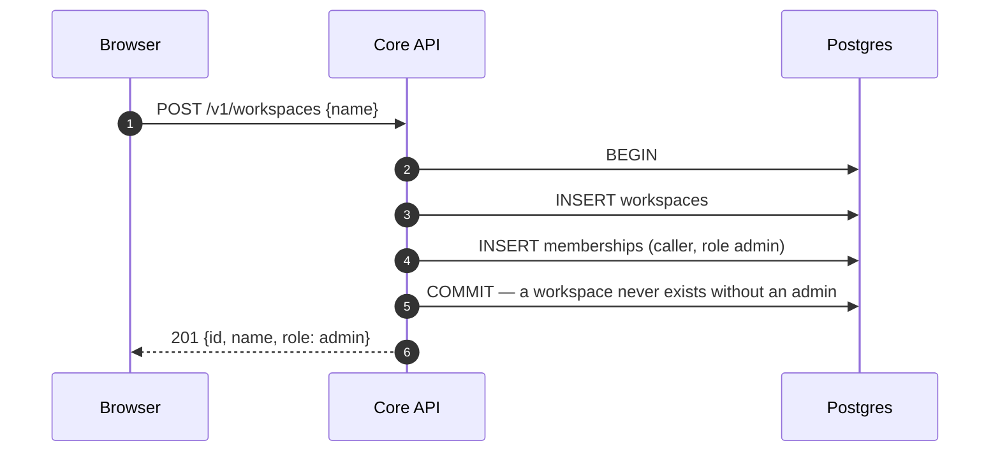
```mermaid
sequenceDiagram
    autonumber
    participant B as Browser
    participant API as Core API
    participant PG as Postgres

    B->>API: POST /v1/workspaces {name}
    API->>PG: BEGIN
    API->>PG: INSERT workspaces
    API->>PG: INSERT memberships (caller, role admin)
    API->>PG: COMMIT — a workspace never exists without an admin
    API-->>B: 201 {id, name, role: admin}
```

### 10. Invite a member

`workspace/app/service.go` (`Invite`).

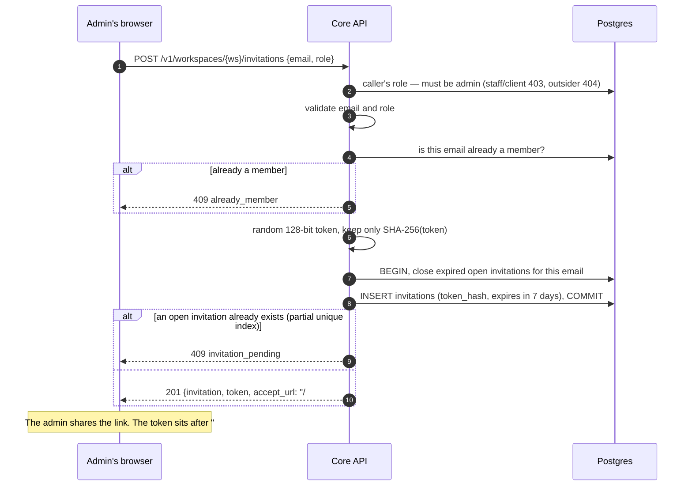
```mermaid
sequenceDiagram
    autonumber
    participant A as Admin's browser
    participant API as Core API
    participant PG as Postgres

    A->>API: POST /v1/workspaces/{ws}/invitations {email, role}
    API->>PG: caller's role — must be admin (staff/client 403, outsider 404)
    API->>API: validate email and role
    API->>PG: is this email already a member?
    alt already a member
        API-->>A: 409 already_member
    end
    API->>API: random 128-bit token, keep only SHA-256(token)
    API->>PG: BEGIN, close expired open invitations for this email
    API->>PG: INSERT invitations (token_hash, expires in 7 days), COMMIT
    alt an open invitation already exists (partial unique index)
        API-->>A: 409 invitation_pending
    else
        API-->>A: 201 {invitation, token, accept_url: "/#accept=TOKEN"}
    end
    Note over A: The admin shares the link. The token sits after "#", so browsers never send it to any server log.
```

### 11. Accept an invitation

`web/static/app.js` (`readInviteToken`), `workspace/app/service.go` (`AcceptInvitation`).

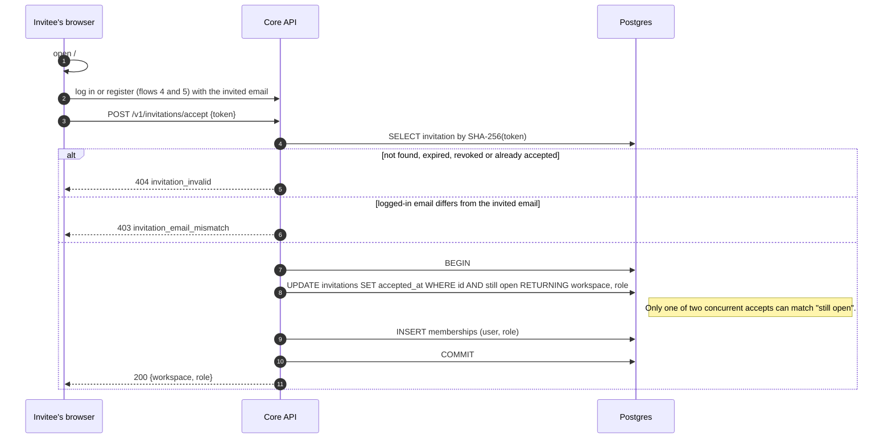
```mermaid
sequenceDiagram
    autonumber
    participant B as Invitee's browser
    participant API as Core API
    participant PG as Postgres

    B->>B: open /#accept=TOKEN — read the token, remove it from the address bar
    B->>API: log in or register (flows 4 and 5) with the invited email
    B->>API: POST /v1/invitations/accept {token}
    API->>PG: SELECT invitation by SHA-256(token)
    alt not found, expired, revoked or already accepted
        API-->>B: 404 invitation_invalid
    else logged-in email differs from the invited email
        API-->>B: 403 invitation_email_mismatch
    else
        API->>PG: BEGIN
        API->>PG: UPDATE invitations SET accepted_at WHERE id AND still open RETURNING workspace, role
        Note right of PG: Only one of two concurrent accepts can match "still open".
        API->>PG: INSERT memberships (user, role)
        API->>PG: COMMIT
        API-->>B: 200 {workspace, role}
    end
```

### 12. Change role or remove a member

`workspace/infra/postgres.go` (`ChangeRole`, `RemoveMember`, `lockMember`).

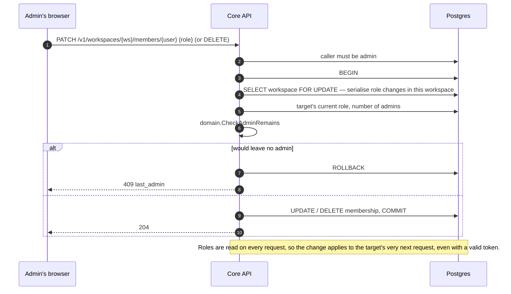
```mermaid
sequenceDiagram
    autonumber
    participant A as Admin's browser
    participant API as Core API
    participant PG as Postgres

    A->>API: PATCH /v1/workspaces/{ws}/members/{user} {role} (or DELETE)
    API->>PG: caller must be admin
    API->>PG: BEGIN
    API->>PG: SELECT workspace FOR UPDATE — serialise role changes in this workspace
    API->>PG: target's current role, number of admins
    API->>API: domain.CheckAdminRemains
    alt would leave no admin
        API->>PG: ROLLBACK
        API-->>A: 409 last_admin
    else
        API->>PG: UPDATE / DELETE membership, COMMIT
        API-->>A: 204
    end
    Note over API,PG: Roles are read on every request, so the change applies to the target's very next request, even with a valid token.
```

---

## Part 2: document library

Files never pass through the API: the browser uploads and downloads with short-lived presigned
URLs, and background work goes through the transactional outbox (ADR 0003).

### 13. Upload a document

`document/app/service.go` (`CreateUpload`, `CompleteUpload`), `platform/objectstore`.

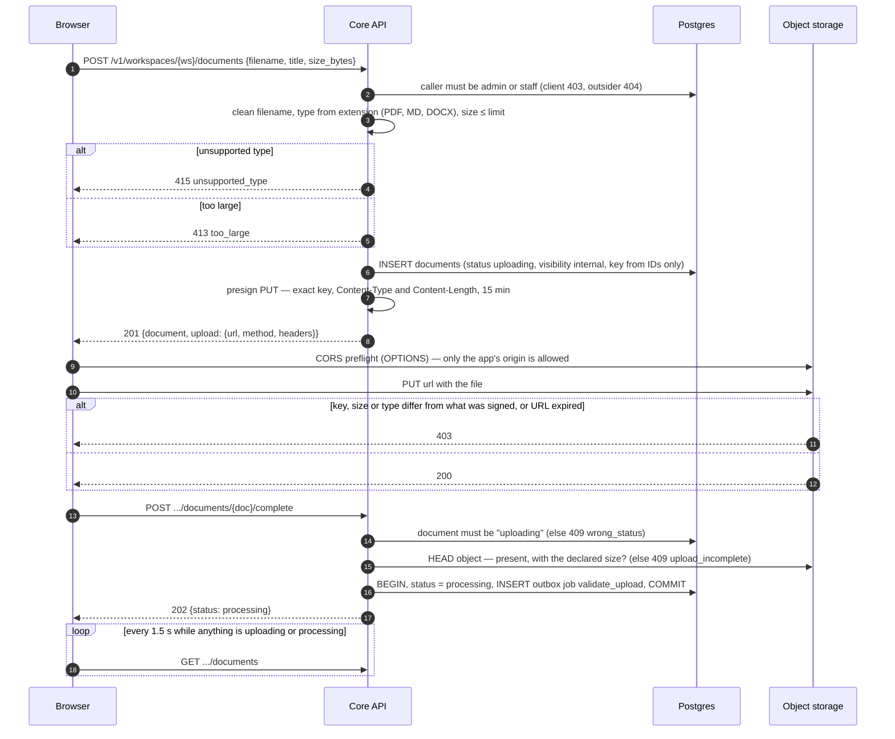
```mermaid
sequenceDiagram
    autonumber
    participant B as Browser
    participant API as Core API
    participant PG as Postgres
    participant S3 as Object storage

    B->>API: POST /v1/workspaces/{ws}/documents {filename, title, size_bytes}
    API->>PG: caller must be admin or staff (client 403, outsider 404)
    API->>API: clean filename, type from extension (PDF, MD, DOCX), size ≤ limit
    alt unsupported type
        API-->>B: 415 unsupported_type
    else too large
        API-->>B: 413 too_large
    end
    API->>PG: INSERT documents (status uploading, visibility internal, key from IDs only)
    API->>API: presign PUT — exact key, Content-Type and Content-Length, 15 min
    API-->>B: 201 {document, upload: {url, method, headers}}
    B->>S3: CORS preflight (OPTIONS) — only the app's origin is allowed
    B->>S3: PUT url with the file
    alt key, size or type differ from what was signed, or URL expired
        S3-->>B: 403
    else
        S3-->>B: 200
    end
    B->>API: POST .../documents/{doc}/complete
    API->>PG: document must be "uploading" (else 409 wrong_status)
    API->>S3: HEAD object — present, with the declared size? (else 409 upload_incomplete)
    API->>PG: BEGIN, status = processing, INSERT outbox job validate_upload, COMMIT
    API-->>B: 202 {status: processing}
    loop every 1.5 s while anything is uploading or processing
        B->>API: GET .../documents
    end
```

### 14. Content check (background)

`document/app/jobs.go` (`ValidateUpload`), run by the outbox worker (flow 20).

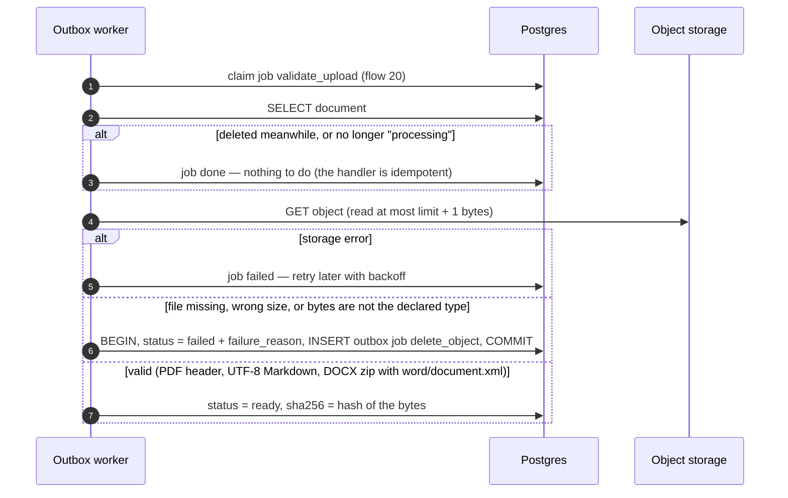
```mermaid
sequenceDiagram
    autonumber
    participant W as Outbox worker
    participant PG as Postgres
    participant S3 as Object storage

    W->>PG: claim job validate_upload (flow 20)
    W->>PG: SELECT document
    alt deleted meanwhile, or no longer "processing"
        W->>PG: job done — nothing to do (the handler is idempotent)
    end
    W->>S3: GET object (read at most limit + 1 bytes)
    alt storage error
        W->>PG: job failed — retry later with backoff
    else file missing, wrong size, or bytes are not the declared type
        W->>PG: BEGIN, status = failed + failure_reason, INSERT outbox job delete_object, COMMIT
    else valid (PDF header, UTF-8 Markdown, DOCX zip with word/document.xml)
        W->>PG: status = ready, sha256 = hash of the bytes
    end
```

### 15. List documents

`document/app/service.go` (`List`), `document/app/cursor.go`, `document/infra/postgres.go`.

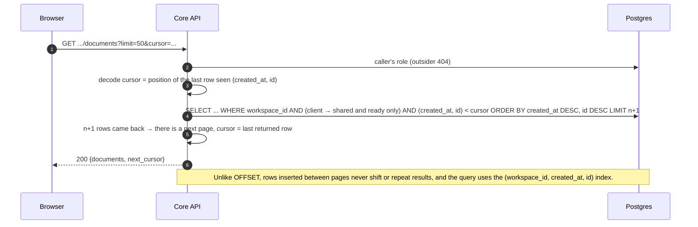
```mermaid
sequenceDiagram
    autonumber
    participant B as Browser
    participant API as Core API
    participant PG as Postgres

    B->>API: GET .../documents?limit=50&cursor=...
    API->>PG: caller's role (outsider 404)
    API->>API: decode cursor = position of the last row seen (created_at, id)
    API->>PG: SELECT ... WHERE workspace_id AND (client → shared and ready only) AND (created_at, id) < cursor ORDER BY created_at DESC, id DESC LIMIT n+1
    API->>API: n+1 rows came back → there is a next page, cursor = last returned row
    API-->>B: 200 {documents, next_cursor}
    Note over API,PG: Unlike OFFSET, rows inserted between pages never shift or repeat results, and the query uses the (workspace_id, created_at, id) index.
```

### 16. Download a document

`document/app/service.go` (`DownloadURL`), `document/transport/http.go` (`download`).

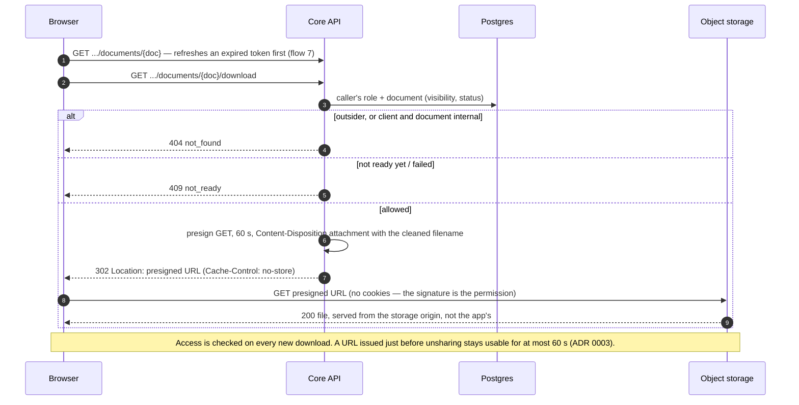
```mermaid
sequenceDiagram
    autonumber
    participant B as Browser
    participant API as Core API
    participant PG as Postgres
    participant S3 as Object storage

    B->>API: GET .../documents/{doc} — refreshes an expired token first (flow 7)
    B->>API: GET .../documents/{doc}/download
    API->>PG: caller's role + document (visibility, status)
    alt outsider, or client and document internal
        API-->>B: 404 not_found
    else not ready yet / failed
        API-->>B: 409 not_ready
    else allowed
        API->>API: presign GET, 60 s, Content-Disposition attachment with the cleaned filename
        API-->>B: 302 Location: presigned URL (Cache-Control: no-store)
        B->>S3: GET presigned URL (no cookies — the signature is the permission)
        S3-->>B: 200 file, served from the storage origin, not the app's
    end
    Note over B,S3: Access is checked on every new download. A URL issued just before unsharing stays usable for at most 60 s (ADR 0003).
```

### 17. Share and unshare

`document/app/service.go` (`Update`).

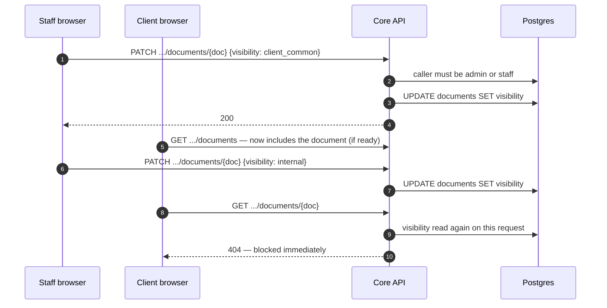
```mermaid
sequenceDiagram
    autonumber
    participant S as Staff browser
    participant C as Client browser
    participant API as Core API
    participant PG as Postgres

    S->>API: PATCH .../documents/{doc} {visibility: client_common}
    API->>PG: caller must be admin or staff
    API->>PG: UPDATE documents SET visibility
    API-->>S: 200
    C->>API: GET .../documents — now includes the document (if ready)
    S->>API: PATCH .../documents/{doc} {visibility: internal}
    API->>PG: UPDATE documents SET visibility
    C->>API: GET .../documents/{doc}
    API->>PG: visibility read again on this request
    API-->>C: 404 — blocked immediately
```

### 18. Delete a document

`document/app/service.go` (`Delete`), `document/infra/postgres.go` (`Delete`).

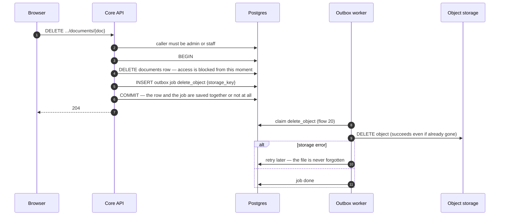
```mermaid
sequenceDiagram
    autonumber
    participant B as Browser
    participant API as Core API
    participant PG as Postgres
    participant W as Outbox worker
    participant S3 as Object storage

    B->>API: DELETE .../documents/{doc}
    API->>PG: caller must be admin or staff
    API->>PG: BEGIN
    API->>PG: DELETE documents row — access is blocked from this moment
    API->>PG: INSERT outbox job delete_object {storage_key}
    API->>PG: COMMIT — the row and the job are saved together or not at all
    API-->>B: 204
    W->>PG: claim delete_object (flow 20)
    W->>S3: DELETE object (succeeds even if already gone)
    alt storage error
        W->>PG: retry later — the file is never forgotten
    else
        W->>PG: job done
    end
```

### 19. Abandoned upload sweep

`document/app/jobs.go` (`CleanupAbandonedUploads`), started every 10 minutes from `main.go`.

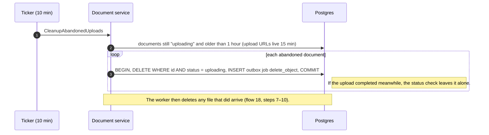
```mermaid
sequenceDiagram
    autonumber
    participant T as Ticker (10 min)
    participant APP as Document service
    participant PG as Postgres

    T->>APP: CleanupAbandonedUploads
    APP->>PG: documents still "uploading" and older than 1 hour (upload URLs live 15 min)
    loop each abandoned document
        APP->>PG: BEGIN, DELETE WHERE id AND status = uploading, INSERT outbox job delete_object, COMMIT
        Note right of PG: If the upload completed meanwhile, the status check leaves it alone.
    end
    Note over APP,PG: The worker then deletes any file that did arrive (flow 18, steps 7–10).
```

### 20. Outbox worker

`api/internal/platform/outbox/outbox.go`. One goroutine in the API process; several workers can
share the table safely. Jobs are leased, not held in a transaction, so no database connection is
held while a handler runs.

```mermaid
sequenceDiagram
    autonumber
    participant W as Worker
    participant PG as Postgres
    participant H as Handler (validate_upload / delete_object)

    loop until shutdown — poll every second, immediately again after a job
        W->>PG: claim in one statement: UPDATE job SET locked_until = now + 5 min, lease_token = new UUID, attempts + 1 WHERE id = (oldest due job of my kinds, not leased or lease expired, FOR UPDATE SKIP LOCKED) RETURNING
        Note right of PG: Committed at once. No connection is held from here on.
        alt no job
            W->>W: sleep 1 s
        else job leased
            par handler, cancelled after 2 min
                W->>H: run handler(payload)
            and heartbeat every 100 s
                W->>PG: UPDATE locked_until = now + 5 min WHERE id AND lease_token
                Note right of PG: 0 rows means the lease was lost: cancel the handler.
            end
            alt success
                W->>PG: DELETE job WHERE id AND lease_token
            else error and attempts < 10
                W->>PG: last_error, run_after = now + backoff (2^attempts s, half of it random, max 1 h), clear lease — WHERE id AND lease_token
            else error and attempts reached 10
                W->>PG: dead_at = now, clear lease — WHERE id AND lease_token
            end
            Note over W,PG: Every finishing statement checks lease_token (fencing). A worker whose lease expired and was taken over changes nothing.
        end
    end
    Note over W,PG: If a worker dies mid-job, nobody renews its lease. After 5 minutes the lease expires and another worker claims the job (at-least-once, so handlers are idempotent).
```
