# Runtime flows

Every runtime flow of the system, as sequence diagrams that match the code. Update this file
whenever a flow changes. GitHub renders the diagrams; locally, any Markdown preview with
Mermaid support works.

Contents

- [Components](#components)
- Part 0, foundation: [Startup and shutdown](#1-startup-and-shutdown) · [Request pipeline](#2-request-pipeline) · [Core API calls RAG over gRPC](#3-core-api-calls-rag-over-grpc)
- Part 1, accounts and workspaces: [Register](#4-register) · [Login](#5-login) · [Authenticated request](#6-authenticated-request) · [Refresh tokens](#7-refresh-tokens) · [Logout](#8-logout) · [Create workspace](#9-create-workspace) · [Invite a member](#10-invite-a-member) · [Accept an invitation](#11-accept-an-invitation) · [Change role or remove a member](#12-change-role-or-remove-a-member)
- Part 2, document library: [Upload](#13-upload-a-document) · [Content check](#14-content-check-background) · [List](#15-list-documents) · [Download](#16-download-a-document) · [Share and unshare](#17-share-and-unshare) · [Delete](#18-delete-a-document) · [Abandoned uploads](#19-abandoned-upload-sweep) · [Outbox worker](#20-outbox-worker)
- Part 3, LLM Gateway: [Gateway startup](#21-gateway-startup) · [Streamed chat](#22-streamed-chat-completion) · [Fallback before output](#23-fallback-before-output) · [Failure after output began](#24-failure-after-output-began) · [Caller cancels](#25-caller-cancels) · [Embeddings](#26-embeddings) · [Rate limit](#27-rate-limit) · [Change AI settings](#28-change-ai-settings)
- Part 4, RAG and Q&A: [Document change reaches the index](#29-document-change-reaches-the-index) · [Indexing a document](#30-indexing-a-document) · [Worker failures and retries](#31-worker-failures-and-retries) · [Ask a question](#32-ask-a-question) · [Retrieval and access check](#33-retrieval-and-access-check) · [Earlier answers after access is lost](#34-earlier-answers-after-access-is-lost)

## Components

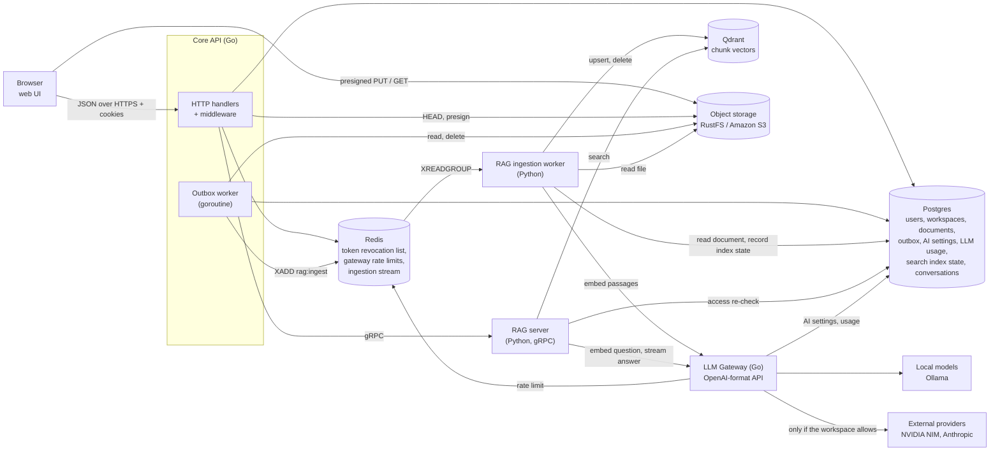
```mermaid
flowchart LR
    Browser["Browser<br/>web UI"]
    subgraph API["Core API (Go)"]
        HTTP["HTTP handlers<br/>+ middleware"]
        Worker["Outbox worker<br/>(goroutine)"]
    end
    RAG["RAG server<br/>(Python, gRPC)"]
    Ingest["RAG ingestion worker<br/>(Python)"]
    GW["LLM Gateway (Go)<br/>OpenAI-format API"]
    PG[("Postgres<br/>users, workspaces, documents,<br/>outbox, AI settings, LLM usage,<br/>search index state, conversations")]
    Redis[("Redis<br/>token revocation list,<br/>gateway rate limits,<br/>ingestion stream")]
    Qdrant[("Qdrant<br/>chunk vectors")]
    S3[("Object storage<br/>RustFS / Amazon S3")]
    Local["Local models<br/>Ollama"]
    External["External providers<br/>NVIDIA NIM, Anthropic"]

    Browser -->|"JSON over HTTPS + cookies"| HTTP
    Browser -->|"presigned PUT / GET"| S3
    HTTP --> PG
    HTTP --> Redis
    HTTP -->|"HEAD, presign"| S3
    HTTP -->|"gRPC"| RAG
    Worker --> PG
    Worker -->|"read, delete"| S3
    Worker -->|"XADD rag:ingest"| Redis
    Redis -->|"XREADGROUP"| Ingest
    Ingest -->|"read document, record index state"| PG
    Ingest -->|"read file"| S3
    Ingest -->|"embed passages"| GW
    Ingest -->|"upsert, delete"| Qdrant
    RAG -->|"embed question, stream answer"| GW
    RAG -->|"search"| Qdrant
    RAG -->|"access re-check"| PG
    GW -->|"AI settings, usage"| PG
    GW -->|"rate limit"| Redis
    GW --> Local
    GW -->|"only if the workspace allows"| External
```

---

## Part 0: foundation

### 1. Startup and shutdown

`api/cmd/api/main.go`. Configuration is validated before anything starts; every resource is
closed in reverse order on shutdown. A second signal kills the process at once.

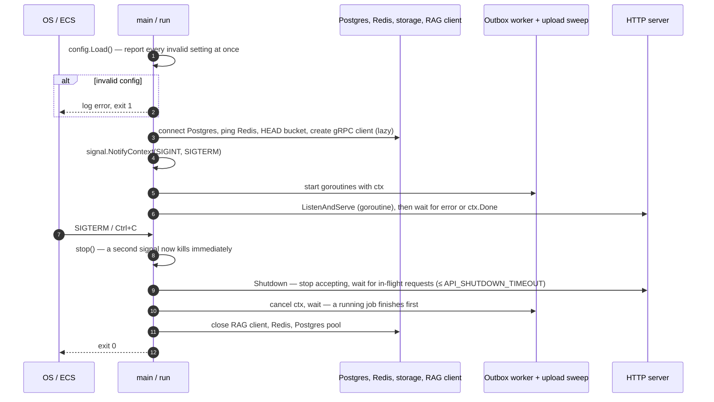
```mermaid
sequenceDiagram
    autonumber
    participant OS as OS / ECS
    participant Main as main / run
    participant Deps as Postgres, Redis, storage, RAG client
    participant BG as Outbox worker + upload sweep
    participant HTTP as HTTP server

    Main->>Main: config.Load() — report every invalid setting at once
    alt invalid config
        Main-->>OS: log error, exit 1
    end
    Main->>Deps: connect Postgres, ping Redis, HEAD bucket, create gRPC client (lazy)
    Main->>Main: signal.NotifyContext(SIGINT, SIGTERM)
    Main->>BG: start goroutines with ctx
    Main->>HTTP: ListenAndServe (goroutine), then wait for error or ctx.Done
    OS->>Main: SIGTERM / Ctrl+C
    Main->>Main: stop() — a second signal now kills immediately
    Main->>HTTP: Shutdown — stop accepting, wait for in-flight requests (≤ API_SHUTDOWN_TIMEOUT)
    Main->>BG: cancel ctx, wait — a running job finishes first
    Main->>Deps: close RAG client, Redis, Postgres pool
    Main-->>OS: exit 0
```

### 2. Request pipeline

`api/cmd/api/routes.go`, `internal/platform/httpserver/middleware.go`. Every request goes
through the same three middleware before routing.

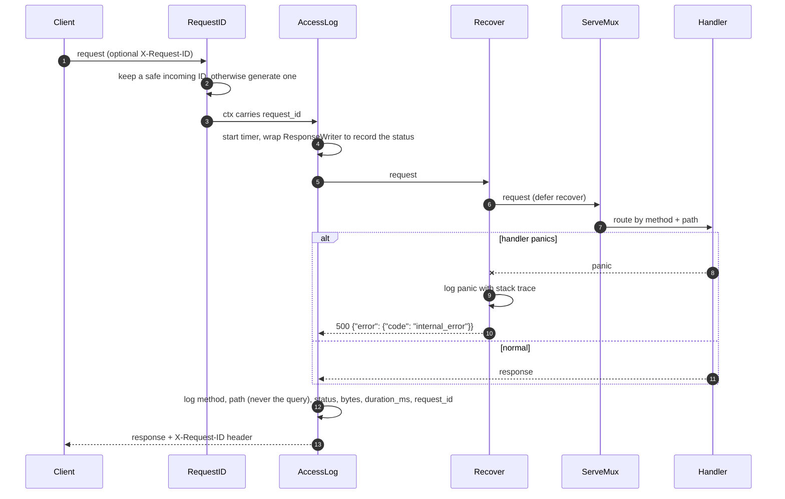
```mermaid
sequenceDiagram
    autonumber
    participant C as Client
    participant RID as RequestID
    participant LOG as AccessLog
    participant REC as Recover
    participant MUX as ServeMux
    participant H as Handler

    C->>RID: request (optional X-Request-ID)
    RID->>RID: keep a safe incoming ID, otherwise generate one
    RID->>LOG: ctx carries request_id
    LOG->>LOG: start timer, wrap ResponseWriter to record the status
    LOG->>REC: request
    REC->>MUX: request (defer recover)
    MUX->>H: route by method + path
    alt handler panics
        H--xREC: panic
        REC->>REC: log panic with stack trace
        REC-->>LOG: 500 {"error": {"code": "internal_error"}}
    else normal
        H-->>LOG: response
    end
    LOG->>LOG: log method, path (never the query), status, bytes, duration_ms, request_id
    LOG-->>C: response + X-Request-ID header
```

### 3. Core API calls RAG over gRPC

`api/internal/ragclient`, `rag/src/rag/server.py`. Debug route only
(`API_ENABLE_DEBUG_ROUTES=true`); real RAG calls arrive in Part 4.

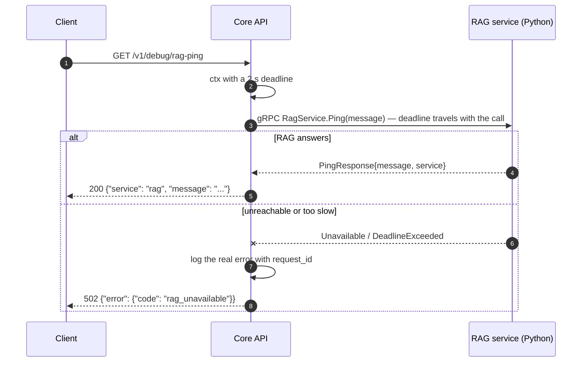
```mermaid
sequenceDiagram
    autonumber
    participant C as Client
    participant API as Core API
    participant RAG as RAG service (Python)

    C->>API: GET /v1/debug/rag-ping
    API->>API: ctx with a 2 s deadline
    API->>RAG: gRPC RagService.Ping(message) — deadline travels with the call
    alt RAG answers
        RAG-->>API: PingResponse{message, service}
        API-->>C: 200 {"service": "rag", "message": "..."}
    else unreachable or too slow
        RAG--xAPI: Unavailable / DeadlineExceeded
        API->>API: log the real error with request_id
        API-->>C: 502 {"error": {"code": "rag_unavailable"}}
    end
```

---

## Part 1: accounts and workspaces

### 4. Register

`api/internal/identity/app/service.go` (`Register`). Registering does not log in; the UI calls
login right after.

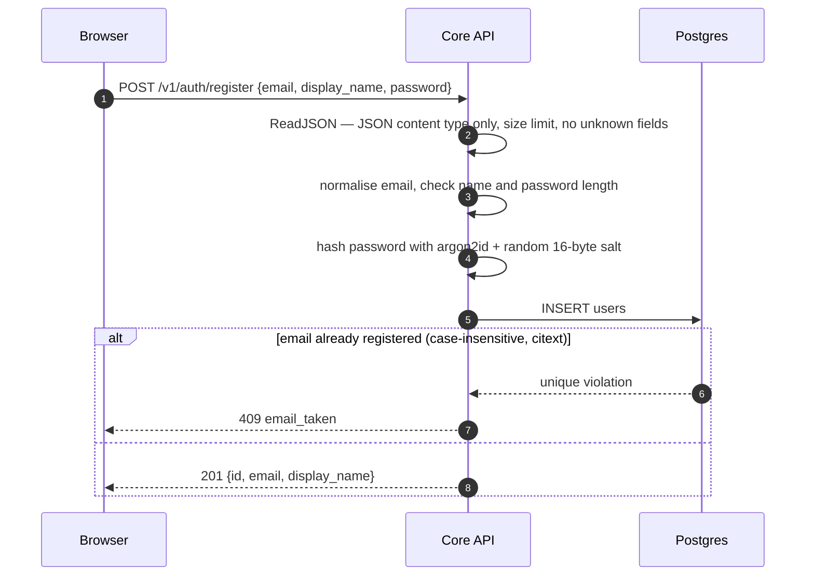
```mermaid
sequenceDiagram
    autonumber
    participant B as Browser
    participant API as Core API
    participant PG as Postgres

    B->>API: POST /v1/auth/register {email, display_name, password}
    API->>API: ReadJSON — JSON content type only, size limit, no unknown fields
    API->>API: normalise email, check name and password length
    API->>API: hash password with argon2id + random 16-byte salt
    API->>PG: INSERT users
    alt email already registered (case-insensitive, citext)
        PG-->>API: unique violation
        API-->>B: 409 email_taken
    else
        API-->>B: 201 {id, email, display_name}
    end
```

### 5. Login

`identity/app/service.go` (`Login`), `identity/app/tokens.go`, ADR 0002.

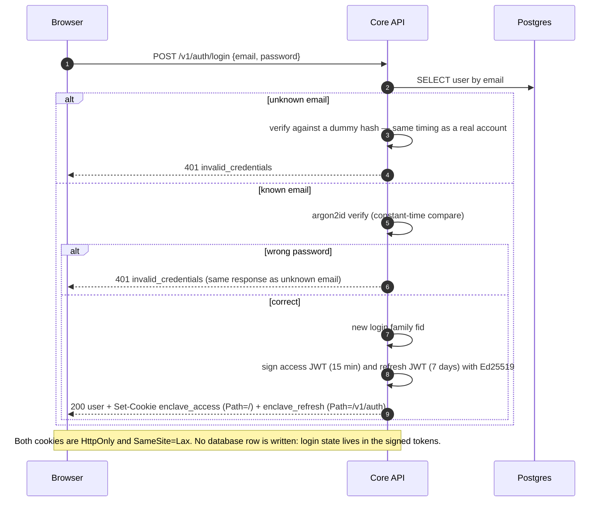
```mermaid
sequenceDiagram
    autonumber
    participant B as Browser
    participant API as Core API
    participant PG as Postgres

    B->>API: POST /v1/auth/login {email, password}
    API->>PG: SELECT user by email
    alt unknown email
        API->>API: verify against a dummy hash — same timing as a real account
        API-->>B: 401 invalid_credentials
    else known email
        API->>API: argon2id verify (constant-time compare)
        alt wrong password
            API-->>B: 401 invalid_credentials (same response as unknown email)
        else correct
            API->>API: new login family fid
            API->>API: sign access JWT (15 min) and refresh JWT (7 days) with Ed25519
            API-->>B: 200 user + Set-Cookie enclave_access (Path=/) + enclave_refresh (Path=/v1/auth)
        end
    end
    Note over B,API: Both cookies are HttpOnly and SameSite=Lax. No database row is written: login state lives in the signed tokens.
```

### 6. Authenticated request

`identity/transport/http.go` (`RequireAuth`), `workspace/app/service.go`. Identity comes from
the token; permissions always come from Postgres.

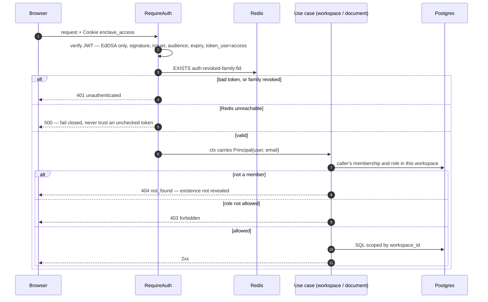
```mermaid
sequenceDiagram
    autonumber
    participant B as Browser
    participant MW as RequireAuth
    participant R as Redis
    participant APP as Use case (workspace / document)
    participant PG as Postgres

    B->>MW: request + Cookie enclave_access
    MW->>MW: verify JWT — EdDSA only, signature, issuer, audience, expiry, token_use=access
    MW->>R: EXISTS auth:revoked-family:fid
    alt bad token, or family revoked
        MW-->>B: 401 unauthenticated
    else Redis unreachable
        MW-->>B: 500 — fail closed, never trust an unchecked token
    else valid
        MW->>APP: ctx carries Principal{user, email}
        APP->>PG: caller's membership and role in this workspace
        alt not a member
            APP-->>B: 404 not_found — existence not revealed
        else role not allowed
            APP-->>B: 403 forbidden
        else allowed
            APP->>PG: SQL scoped by workspace_id
            APP-->>B: 2xx
        end
    end
```

### 7. Refresh tokens

`identity/app/service.go` (`Refresh`), `identity/infra/redis.go`. The UI calls this when any
request returns 401, then retries once.

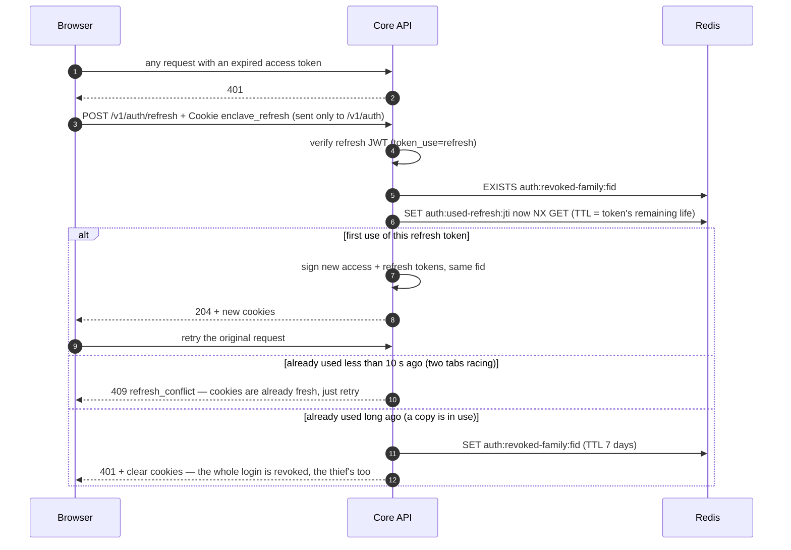
```mermaid
sequenceDiagram
    autonumber
    participant B as Browser
    participant API as Core API
    participant R as Redis

    B->>API: any request with an expired access token
    API-->>B: 401
    B->>API: POST /v1/auth/refresh + Cookie enclave_refresh (sent only to /v1/auth)
    API->>API: verify refresh JWT (token_use=refresh)
    API->>R: EXISTS auth:revoked-family:fid
    API->>R: SET auth:used-refresh:jti now NX GET (TTL = token's remaining life)
    alt first use of this refresh token
        API->>API: sign new access + refresh tokens, same fid
        API-->>B: 204 + new cookies
        B->>API: retry the original request
    else already used less than 10 s ago (two tabs racing)
        API-->>B: 409 refresh_conflict — cookies are already fresh, just retry
    else already used long ago (a copy is in use)
        API->>R: SET auth:revoked-family:fid (TTL 7 days)
        API-->>B: 401 + clear cookies — the whole login is revoked, the thief's too
    end
```

### 8. Logout

`identity/app/service.go` (`Logout`). Works even with an expired access token.

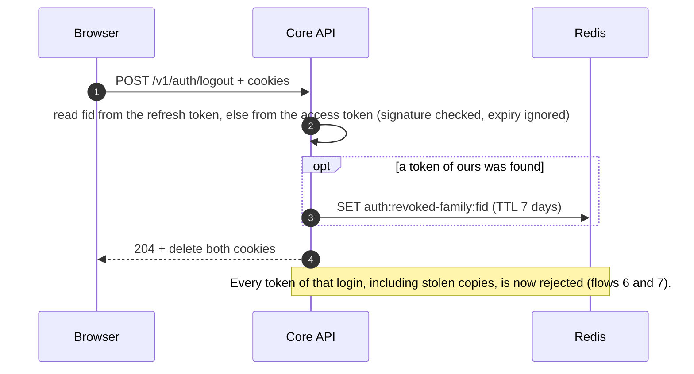
```mermaid
sequenceDiagram
    autonumber
    participant B as Browser
    participant API as Core API
    participant R as Redis

    B->>API: POST /v1/auth/logout + cookies
    API->>API: read fid from the refresh token, else from the access token (signature checked, expiry ignored)
    opt a token of ours was found
        API->>R: SET auth:revoked-family:fid (TTL 7 days)
    end
    API-->>B: 204 + delete both cookies
    Note over API,R: Every token of that login, including stolen copies, is now rejected (flows 6 and 7).
```

### 9. Create workspace

`workspace/app/service.go` (`CreateWorkspace`), `workspace/infra/postgres.go`.

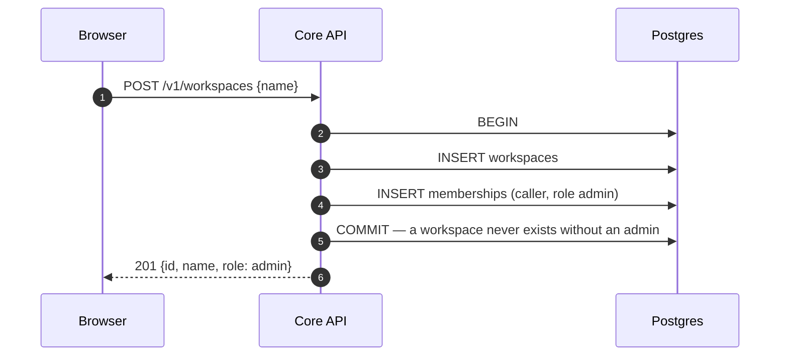
```mermaid
sequenceDiagram
    autonumber
    participant B as Browser
    participant API as Core API
    participant PG as Postgres

    B->>API: POST /v1/workspaces {name}
    API->>PG: BEGIN
    API->>PG: INSERT workspaces
    API->>PG: INSERT memberships (caller, role admin)
    API->>PG: COMMIT — a workspace never exists without an admin
    API-->>B: 201 {id, name, role: admin}
```

### 10. Invite a member

`workspace/app/service.go` (`Invite`).

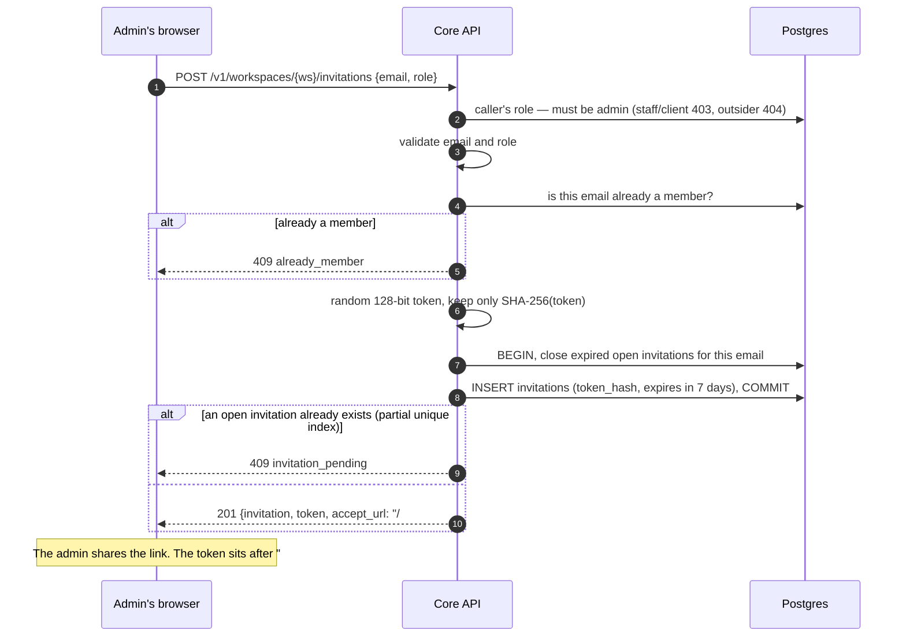
```mermaid
sequenceDiagram
    autonumber
    participant A as Admin's browser
    participant API as Core API
    participant PG as Postgres

    A->>API: POST /v1/workspaces/{ws}/invitations {email, role}
    API->>PG: caller's role — must be admin (staff/client 403, outsider 404)
    API->>API: validate email and role
    API->>PG: is this email already a member?
    alt already a member
        API-->>A: 409 already_member
    end
    API->>API: random 128-bit token, keep only SHA-256(token)
    API->>PG: BEGIN, close expired open invitations for this email
    API->>PG: INSERT invitations (token_hash, expires in 7 days), COMMIT
    alt an open invitation already exists (partial unique index)
        API-->>A: 409 invitation_pending
    else
        API-->>A: 201 {invitation, token, accept_url: "/#accept=TOKEN"}
    end
    Note over A: The admin shares the link. The token sits after "#", so browsers never send it to any server log.
```

### 11. Accept an invitation

`web/static/app.js` (`readInviteToken`), `workspace/app/service.go` (`AcceptInvitation`).

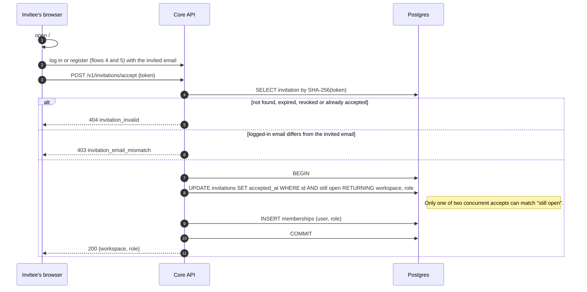
```mermaid
sequenceDiagram
    autonumber
    participant B as Invitee's browser
    participant API as Core API
    participant PG as Postgres

    B->>B: open /#accept=TOKEN — read the token, remove it from the address bar
    B->>API: log in or register (flows 4 and 5) with the invited email
    B->>API: POST /v1/invitations/accept {token}
    API->>PG: SELECT invitation by SHA-256(token)
    alt not found, expired, revoked or already accepted
        API-->>B: 404 invitation_invalid
    else logged-in email differs from the invited email
        API-->>B: 403 invitation_email_mismatch
    else
        API->>PG: BEGIN
        API->>PG: UPDATE invitations SET accepted_at WHERE id AND still open RETURNING workspace, role
        Note right of PG: Only one of two concurrent accepts can match "still open".
        API->>PG: INSERT memberships (user, role)
        API->>PG: COMMIT
        API-->>B: 200 {workspace, role}
    end
```

### 12. Change role or remove a member

`workspace/infra/postgres.go` (`ChangeRole`, `RemoveMember`, `lockMember`).

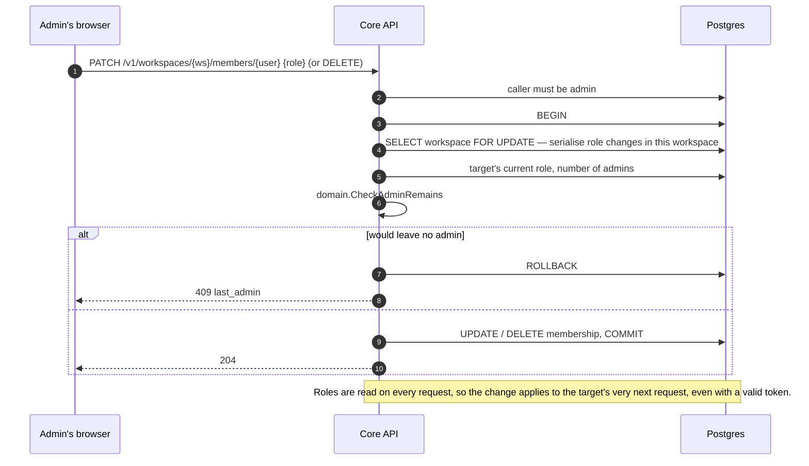
```mermaid
sequenceDiagram
    autonumber
    participant A as Admin's browser
    participant API as Core API
    participant PG as Postgres

    A->>API: PATCH /v1/workspaces/{ws}/members/{user} {role} (or DELETE)
    API->>PG: caller must be admin
    API->>PG: BEGIN
    API->>PG: SELECT workspace FOR UPDATE — serialise role changes in this workspace
    API->>PG: target's current role, number of admins
    API->>API: domain.CheckAdminRemains
    alt would leave no admin
        API->>PG: ROLLBACK
        API-->>A: 409 last_admin
    else
        API->>PG: UPDATE / DELETE membership, COMMIT
        API-->>A: 204
    end
    Note over API,PG: Roles are read on every request, so the change applies to the target's very next request, even with a valid token.
```

---

## Part 2: document library

Files never pass through the API: the browser uploads and downloads with short-lived presigned
URLs, and background work goes through the transactional outbox (ADR 0003).

### 13. Upload a document

`document/app/service.go` (`CreateUpload`, `CompleteUpload`), `platform/objectstore`.

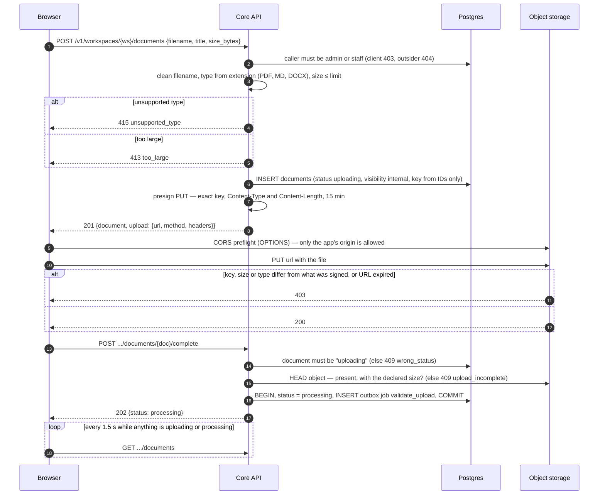
```mermaid
sequenceDiagram
    autonumber
    participant B as Browser
    participant API as Core API
    participant PG as Postgres
    participant S3 as Object storage

    B->>API: POST /v1/workspaces/{ws}/documents {filename, title, size_bytes}
    API->>PG: caller must be admin or staff (client 403, outsider 404)
    API->>API: clean filename, type from extension (PDF, MD, DOCX), size ≤ limit
    alt unsupported type
        API-->>B: 415 unsupported_type
    else too large
        API-->>B: 413 too_large
    end
    API->>PG: INSERT documents (status uploading, visibility internal, key from IDs only)
    API->>API: presign PUT — exact key, Content-Type and Content-Length, 15 min
    API-->>B: 201 {document, upload: {url, method, headers}}
    B->>S3: CORS preflight (OPTIONS) — only the app's origin is allowed
    B->>S3: PUT url with the file
    alt key, size or type differ from what was signed, or URL expired
        S3-->>B: 403
    else
        S3-->>B: 200
    end
    B->>API: POST .../documents/{doc}/complete
    API->>PG: document must be "uploading" (else 409 wrong_status)
    API->>S3: HEAD object — present, with the declared size? (else 409 upload_incomplete)
    API->>PG: BEGIN, status = processing, INSERT outbox job validate_upload, COMMIT
    API-->>B: 202 {status: processing}
    loop every 1.5 s while anything is uploading or processing
        B->>API: GET .../documents
    end
```

### 14. Content check (background)

`document/app/jobs.go` (`ValidateUpload`), run by the outbox worker (flow 20).

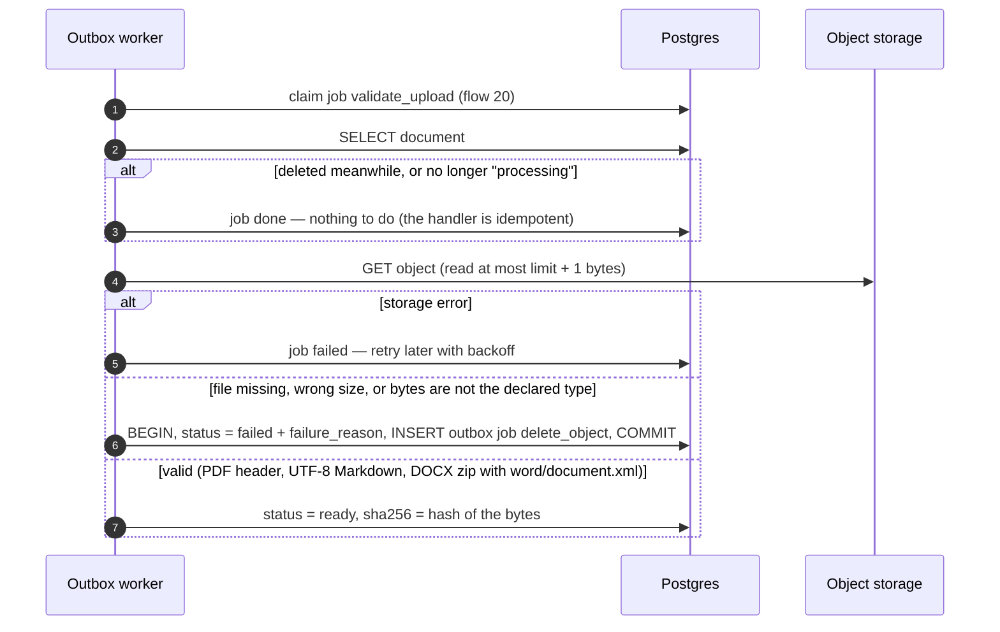
```mermaid
sequenceDiagram
    autonumber
    participant W as Outbox worker
    participant PG as Postgres
    participant S3 as Object storage

    W->>PG: claim job validate_upload (flow 20)
    W->>PG: SELECT document
    alt deleted meanwhile, or no longer "processing"
        W->>PG: job done — nothing to do (the handler is idempotent)
    end
    W->>S3: GET object (read at most limit + 1 bytes)
    alt storage error
        W->>PG: job failed — retry later with backoff
    else file missing, wrong size, or bytes are not the declared type
        W->>PG: BEGIN, status = failed + failure_reason, INSERT outbox job delete_object, COMMIT
    else valid (PDF header, UTF-8 Markdown, DOCX zip with word/document.xml)
        W->>PG: status = ready, sha256 = hash of the bytes
    end
```

### 15. List documents

`document/app/service.go` (`List`), `document/app/cursor.go`, `document/infra/postgres.go`.

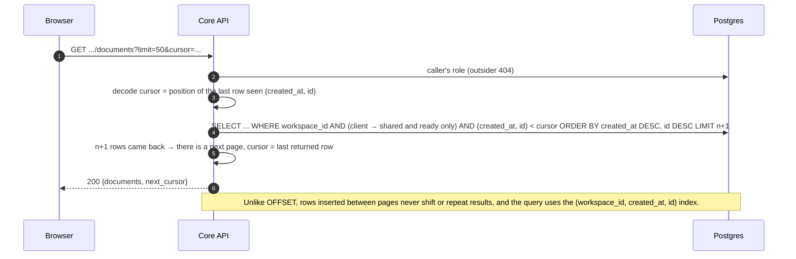
```mermaid
sequenceDiagram
    autonumber
    participant B as Browser
    participant API as Core API
    participant PG as Postgres

    B->>API: GET .../documents?limit=50&cursor=...
    API->>PG: caller's role (outsider 404)
    API->>API: decode cursor = position of the last row seen (created_at, id)
    API->>PG: SELECT ... WHERE workspace_id AND (client → shared and ready only) AND (created_at, id) < cursor ORDER BY created_at DESC, id DESC LIMIT n+1
    API->>API: n+1 rows came back → there is a next page, cursor = last returned row
    API-->>B: 200 {documents, next_cursor}
    Note over API,PG: Unlike OFFSET, rows inserted between pages never shift or repeat results, and the query uses the (workspace_id, created_at, id) index.
```

### 16. Download a document

`document/app/service.go` (`DownloadURL`), `document/transport/http.go` (`download`).

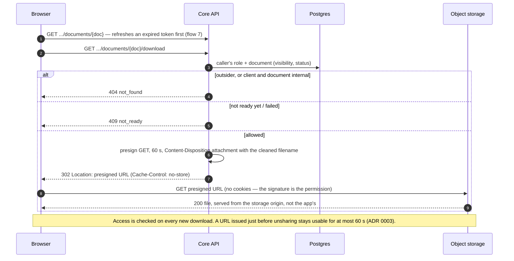
```mermaid
sequenceDiagram
    autonumber
    participant B as Browser
    participant API as Core API
    participant PG as Postgres
    participant S3 as Object storage

    B->>API: GET .../documents/{doc} — refreshes an expired token first (flow 7)
    B->>API: GET .../documents/{doc}/download
    API->>PG: caller's role + document (visibility, status)
    alt outsider, or client and document internal
        API-->>B: 404 not_found
    else not ready yet / failed
        API-->>B: 409 not_ready
    else allowed
        API->>API: presign GET, 60 s, Content-Disposition attachment with the cleaned filename
        API-->>B: 302 Location: presigned URL (Cache-Control: no-store)
        B->>S3: GET presigned URL (no cookies — the signature is the permission)
        S3-->>B: 200 file, served from the storage origin, not the app's
    end
    Note over B,S3: Access is checked on every new download. A URL issued just before unsharing stays usable for at most 60 s (ADR 0003).
```

### 17. Share and unshare

`document/app/service.go` (`Update`).

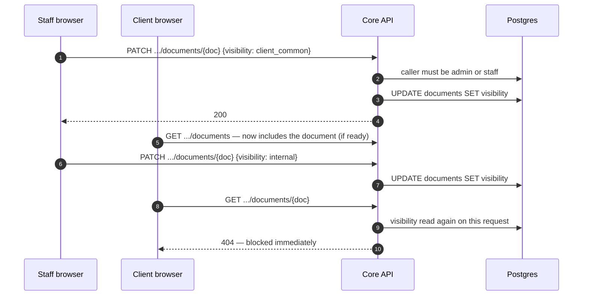
```mermaid
sequenceDiagram
    autonumber
    participant S as Staff browser
    participant C as Client browser
    participant API as Core API
    participant PG as Postgres

    S->>API: PATCH .../documents/{doc} {visibility: client_common}
    API->>PG: caller must be admin or staff
    API->>PG: UPDATE documents SET visibility
    API-->>S: 200
    C->>API: GET .../documents — now includes the document (if ready)
    S->>API: PATCH .../documents/{doc} {visibility: internal}
    API->>PG: UPDATE documents SET visibility
    C->>API: GET .../documents/{doc}
    API->>PG: visibility read again on this request
    API-->>C: 404 — blocked immediately
```

### 18. Delete a document

`document/app/service.go` (`Delete`), `document/infra/postgres.go` (`Delete`).

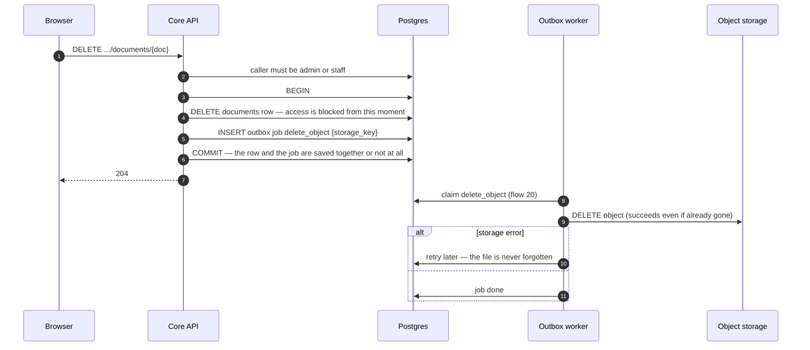
```mermaid
sequenceDiagram
    autonumber
    participant B as Browser
    participant API as Core API
    participant PG as Postgres
    participant W as Outbox worker
    participant S3 as Object storage

    B->>API: DELETE .../documents/{doc}
    API->>PG: caller must be admin or staff
    API->>PG: BEGIN
    API->>PG: DELETE documents row — access is blocked from this moment
    API->>PG: INSERT outbox job delete_object {storage_key}
    API->>PG: COMMIT — the row and the job are saved together or not at all
    API-->>B: 204
    W->>PG: claim delete_object (flow 20)
    W->>S3: DELETE object (succeeds even if already gone)
    alt storage error
        W->>PG: retry later — the file is never forgotten
    else
        W->>PG: job done
    end
```

### 19. Abandoned upload sweep

`document/app/jobs.go` (`CleanupAbandonedUploads`), started every 10 minutes from `main.go`.

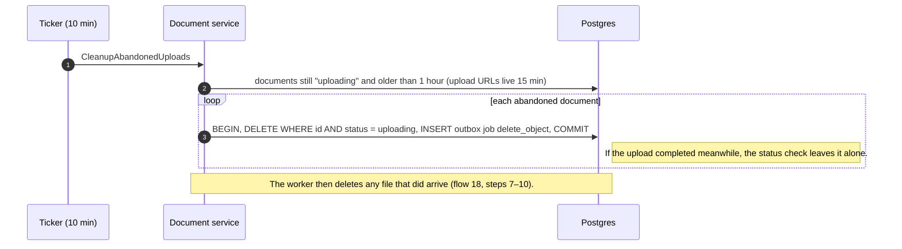
```mermaid
sequenceDiagram
    autonumber
    participant T as Ticker (10 min)
    participant APP as Document service
    participant PG as Postgres

    T->>APP: CleanupAbandonedUploads
    APP->>PG: documents still "uploading" and older than 1 hour (upload URLs live 15 min)
    loop each abandoned document
        APP->>PG: BEGIN, DELETE WHERE id AND status = uploading, INSERT outbox job delete_object, COMMIT
        Note right of PG: If the upload completed meanwhile, the status check leaves it alone.
    end
    Note over APP,PG: The worker then deletes any file that did arrive (flow 18, steps 7–10).
```

### 20. Outbox worker

`internal/platform/outbox/outbox.go`. One goroutine in the API process; several workers can
share the table safely. Jobs are leased, not held in a transaction, so no database connection is
held while a handler runs.

```mermaid
sequenceDiagram
    autonumber
    participant W as Worker
    participant PG as Postgres
    participant H as Handler (validate_upload / delete_object)

    loop until shutdown — poll every second, immediately again after a job
        W->>PG: claim in one statement: UPDATE job SET locked_until = now + 5 min, lease_token = new UUID, attempts + 1 WHERE id = (oldest due job of my kinds, not leased or lease expired, FOR UPDATE SKIP LOCKED) RETURNING
        Note right of PG: Committed at once. No connection is held from here on.
        alt no job
            W->>W: sleep 1 s
        else job leased
            par handler, cancelled after 2 min
                W->>H: run handler(payload)
            and heartbeat every 100 s
                W->>PG: UPDATE locked_until = now + 5 min WHERE id AND lease_token
                Note right of PG: 0 rows means the lease was lost: cancel the handler.
            end
            alt success
                W->>PG: DELETE job WHERE id AND lease_token
            else error and attempts < 10
                W->>PG: last_error, run_after = now + backoff (2^attempts s, half of it random, max 1 h), clear lease — WHERE id AND lease_token
            else error and attempts reached 10
                W->>PG: dead_at = now, clear lease — WHERE id AND lease_token
            end
            Note over W,PG: Every finishing statement checks lease_token (fencing). A worker whose lease expired and was taken over changes nothing.
        end
    end
    Note over W,PG: If a worker dies mid-job, nobody renews its lease. After 5 minutes the lease expires and another worker claims the job (at-least-once, so handlers are idempotent).
```

---

## Part 3: LLM Gateway

The gateway is a separate Go service (`gateway/`). Internal services call it with a service
token and the workspace ID; it never sees browsers or user cookies. Its decisions: ADR 0004.

### 21. Gateway startup

`gateway/cmd/gateway/main.go`, `gateway/internal/config`. The catalog file names providers and
aliases; a provider whose API key is not set is disabled and its routes are skipped.

```mermaid
sequenceDiagram
    autonumber
    participant Main as main / run
    participant Cfg as config
    participant Deps as Postgres, Redis
    participant HTTP as HTTP server

    Main->>Cfg: Load() — env settings, service tokens (name=token, ≥ 16 chars each)
    Main->>Cfg: LoadCatalog(gateway/catalog.json) — unknown fields, unknown providers, embedding fallback are errors
    alt invalid config or catalog
        Main-->>Main: log every problem, exit 1
    end
    Main->>Deps: connect Postgres, ping Redis
    loop each provider in the catalog
        alt api_key_env set but empty
            Main->>Main: log "provider disabled", skip it
        else kind openai (Ollama, NVIDIA, OpenAI)
            Main->>Main: openai adapter: chat + embeddings
        else kind anthropic
            Main->>Main: anthropic adapter (official SDK, env defaults off, 0 retries): chat only
        end
    end
    Main->>HTTP: serve until SIGTERM, then graceful shutdown
```

### 22. Streamed chat completion

`gateway/internal/llm/transport/http.go`, `app/service.go`, `infra/openai`. The happy path.
Before any provider is called, the request is checked, the alias resolved, routes filtered by
the workspace's AI settings, and one token taken from the workspace's bucket.

```mermaid
sequenceDiagram
    autonumber
    participant C as Caller (RAG)
    participant T as transport
    participant S as app.Service
    participant PG as Postgres
    participant R as Redis
    participant P as Provider (Ollama)

    C->>T: POST /v1/chat/completions {model: "chat-fast", stream: true, messages}<br/>Authorization: Bearer token, X-Enclave-Workspace-ID
    T->>T: service token valid? (constant-time) else 401 — workspace header a UUID? else 400
    T->>S: Chat(call, request, sseOutput)
    S->>S: validate messages, max_tokens — alias "chat-fast" known? else 404
    S->>PG: workspace exists? external providers it allows (workspace_ai_settings)
    S->>S: keep routes whose provider is configured and allowed (local ones always are)
    S->>R: token bucket script: refill, take 1 (atomic)
    alt bucket empty
        S-->>T: RateLimitError → 429 + Retry-After
    end
    S->>P: POST /v1/chat/completions stream=true, include_usage (first-token timer 30 s starts)
    P-->>S: data: {"choices":[{"delta":{"content":"Xin"}}]}
    S->>S: first event: stop the timer — committed to this provider
    S->>T: Begin(route) then Write(chunk)
    T-->>C: 200 text/event-stream, X-Enclave-Provider: ollama — data: chunk (flushed)
    loop every further chunk
        P-->>S: data: chunk
        S->>T: Write(chunk)
        T-->>C: data: chunk (flushed)
    end
    P-->>S: finish_reason, usage {prompt_tokens, completion_tokens}, [DONE]
    S->>PG: INSERT llm_usage (attempt 1, ok, tokens, cost, latency, first token)
    T-->>C: finish chunk, usage chunk (if asked), data: [DONE]
```

Non-streamed requests run the same path; `collectOutput` gathers the chunks and the handler
answers with one JSON body.

### 23. Fallback before output

`app/service.go` (`Chat`, `chatAttempt`). The next route is tried only while nothing has reached
the caller and the error is one another provider could avoid: no connection, a timeout, 429,
5xx, and also 401/403/404 (a bad key or a retired model at that provider). 400, 413 and 422 blame
the request itself and are returned at once.

```mermaid
sequenceDiagram
    autonumber
    participant S as app.Service
    participant A as Route 1 (ollama)
    participant B as Route 2 (nvidia, external)
    participant PG as Postgres
    participant T as transport

    S->>A: stream request (first-token timer starts)
    alt connection refused / 503 / 404 model gone
        A-->>S: ProviderError, retryable
    else nothing for 30 s
        S->>S: timer cancels the attempt with cause ErrFirstTokenTimeout
        S->>A: request aborted
    end
    S->>PG: INSERT llm_usage (attempt 1, failed, error_code, 0 tokens — nothing was produced)
    Note over S,B: Route 2 is only in the list if the workspace allows nvidia.
    S->>B: stream request (new first-token timer)
    B-->>S: first chunk
    S->>T: Begin(route 2), Write(...)
    S->>PG: INSERT llm_usage (attempt 2, ok)
    alt every route failed
        S-->>T: ErrAllProvidersFailed → 502 provider_error
    end
```

### 24. Failure after output began

The caller already has part of the answer and a 200 status. Another provider would start the
answer over, so the gateway reports the failure inside the stream and stops.

```mermaid
sequenceDiagram
    autonumber
    participant C as Caller
    participant T as transport (sseOutput)
    participant S as app.Service
    participant P as Provider
    participant PG as Postgres

    P-->>S: data: chunk "half an ans"
    S->>T: Write — caller receives it
    P--xS: connection drops (no finish_reason, no [DONE]) → io.ErrUnexpectedEOF
    S->>PG: INSERT llm_usage (interrupted, tokens estimated from the text seen)
    S-->>T: error, began = true — no fallback
    T-->>C: data: {"error": {"code": "provider_error", ...}} — and no [DONE]
```

### 25. Caller cancels

Cancellation travels down the context: the caller's connection closes, the request context is
cancelled, and the provider request (made with a child context) is aborted, so the model stops
generating and billing.

```mermaid
sequenceDiagram
    autonumber
    participant C as Caller
    participant T as net/http + transport
    participant S as app.Service
    participant P as Provider
    participant PG as Postgres

    C->>T: streaming request
    T-->>C: first chunks
    C--xT: closes the connection (user left, timeout on the caller's side)
    T->>S: r.Context() cancelled
    S->>P: attempt context cancelled → HTTP request aborted
    P-->>P: stops generating
    S->>PG: INSERT llm_usage (cancelled) — with a context that outlives the request
    Note over T: Nothing is written back: nobody is listening.
```

### 26. Embeddings

`transport/http.go` (`embeddings`), `app/service.go` (`Embed`). An embedding alias has exactly
one route: vectors from two models are not comparable, so there is no fallback.

```mermaid
sequenceDiagram
    autonumber
    participant C as Caller (RAG, Part 4)
    participant T as transport
    participant S as app.Service
    participant P as Provider (Ollama or NVIDIA)
    participant PG as Postgres

    C->>T: POST /v1/embeddings {model: "embed-local", input: [...], input_type?, encoding_format?}
    T->>S: Embed(call, request)
    S->>S: 1-256 inputs, alias is an embedding alias, AI policy, rate limit
    S->>P: POST /v1/embeddings (NVIDIA also gets input_type: query | passage)
    P-->>S: vectors with index, usage
    S->>S: order vectors by index, their count must equal the input count
    S->>PG: INSERT llm_usage (embedding)
    T-->>C: {data: [{index, embedding}]} — floats, or base64 little-endian float32 (OpenAI's Python client asks for base64)
```

### 27. Rate limit

`gateway/internal/llm/infra/ratelimit.go`. A token bucket per workspace, run as one Lua script
so concurrent requests through several gateway instances cannot both take the last token.

```mermaid
sequenceDiagram
    autonumber
    participant S as app.Service
    participant R as Redis (Lua script)

    S->>R: EVALSHA bucket "gateway:ratelimit:{workspace}" capacity=20 rate=1/s
    R->>R: now = TIME (Redis clock, same for every gateway instance)
    R->>R: tokens = min(capacity, tokens + elapsed × rate)
    alt tokens ≥ 1
        R->>R: tokens -= 1, save, PEXPIRE until a full refill
        R-->>S: {1, 0} allowed
    else
        R-->>S: {0, ms until one token} → 429, Retry-After
    end
    Note over S,R: Redis unreachable → error → 500. Fail closed: no limiter, no model calls.
```

### 28. Change AI settings

`api/internal/workspace/{domain,app,infra,transport}/ai.go`. The Core API owns the setting; the
gateway reads it on every call, so a change applies to the next model call.

```mermaid
sequenceDiagram
    autonumber
    participant B as Admin's browser
    participant API as Core API
    participant PG as Postgres
    participant GW as LLM Gateway

    B->>API: PUT /v1/workspaces/{ws}/ai-settings {"external_providers": ["nvidia"]}
    API->>PG: caller's role in the workspace
    alt not a member
        API-->>B: 404
    else staff or client
        API-->>B: 403 (staff may GET the settings, clients may not)
    end
    API->>API: every name a known external provider? sort, remove duplicates — else 400
    API->>PG: INSERT ... ON CONFLICT (workspace_id) DO UPDATE external_providers, updated_by, updated_at
    API-->>B: 200 {external_providers, available_external_providers, updated_at}
    Note over GW,PG: Next model call for this workspace: the gateway reads the new list, so nvidia routes become usable (or, after removal, are skipped at once).
```

---

## Part 4: RAG and Q&A

The RAG service (`rag/`) runs two processes: the gRPC server that answers and the ingestion
worker that indexes. The Core API owns access and conversations (`api/internal/chat`). Decisions:
ADR 0005.

### 29. Document change reaches the index

`api/internal/document/app/jobs.go` (`SyncSearchIndex`), `document/infra/searchindex.go`. A
document becoming ready, a new title or visibility, and a delete each queue the same outbox job,
in the same transaction as the change.

```mermaid
sequenceDiagram
    autonumber
    participant API as Core API
    participant PG as Postgres
    participant OW as Outbox worker (Core API)
    participant R as Redis Stream rag:ingest

    API->>PG: BEGIN, change the document (ready, visibility, delete),<br/>INSERT outbox_jobs(document.sync_search_index, document_id), COMMIT
    OW->>PG: lease the job (Part 2 outbox)
    OW->>R: XADD rag:ingest {document_id} (MAXLEN ~100000)
    alt Redis down
        R--xOW: error
        OW->>PG: reschedule with backoff (nothing is lost)
    else added
        OW->>PG: DELETE job
    end
    Note over R: The message only names the document. The worker reads its current state itself, so duplicates and reordering are harmless.
```

### 30. Indexing a document

`rag/src/rag/app/indexing.py` (`Indexer.sync`), `rag/src/rag/worker.py`. Reconcile, do not replay.

```mermaid
sequenceDiagram
    autonumber
    participant W as Ingestion worker
    participant R as Redis
    participant PG as Postgres
    participant S as Object storage
    participant GW as LLM Gateway
    participant Q as Qdrant

    W->>R: XAUTOCLAIM (pending over 2 min) else XREADGROUP group indexers, BLOCK 2 s
    R-->>W: {document_id}, delivery count
    W->>PG: SELECT document (status, visibility, sha256, workspace)
    alt missing or not ready
        W->>Q: delete points of the document
    else indexed before with the same file, title and embedding model
        W->>Q: set visibility on its points (title or sharing changed)
    else needs indexing
        W->>S: GET file
        W->>W: parse (PDF pages, DOCX/Markdown headings) → sections → chunks ≤ 1200 chars, 200 overlap
        W->>GW: POST /v1/embeddings (batches of 32, input_type passage, workspace of the document)
        GW-->>W: vectors (Ollama nomic-embed-text, prefixed "search_document: ")
        W->>Q: create collection chunks_embed-local if missing, upsert points (id = uuid5(document, chunk)),<br/>delete chunks beyond the new count
        W->>PG: SELECT document again
        alt deleted or unready meanwhile
            W->>Q: delete points (a stale run never resurrects a document)
        else visibility changed meanwhile
            W->>Q: set visibility
        end
        W->>PG: UPSERT document_index (indexed, model, sha256, chunk count)
    end
    W->>R: XACK
```

### 31. Worker failures and retries

```mermaid
sequenceDiagram
    autonumber
    participant W as Worker A
    participant W2 as Worker B
    participant R as Redis
    participant PG as Postgres

    W->>R: XREADGROUP → message M (delivery 1)
    alt unreadable file (ParseError), no text, or a permanent gateway error (403 provider not allowed)
        W->>PG: document_index failed + error (shown in the UI)
        W->>R: XACK — retrying would not help
    else gateway, Qdrant or storage unavailable
        W->>W: leave M pending (no ack)
        Note over R: After 2 minutes idle, M is claimed again.
        W2->>R: XAUTOCLAIM min-idle 120 s → M (delivery 2)
    else worker crashes mid-way
        Note over W: M stays pending with A's name
        W2->>R: XAUTOCLAIM → M, same as a retry
    end
    alt delivery 5 fails too
        W2->>PG: document_index failed "gave up after retries"
        W2->>R: XADD rag:ingest:dead {document_id, error}, XACK M
    end
```

### 32. Ask a question

`api/internal/chat/{app,infra,transport}`, `api/internal/ragclient`, `rag/src/rag/transport/grpc_server.py`,
`rag/src/rag/app/answering.py`. The answer streams end to end; nothing waits for the full text.

```mermaid
sequenceDiagram
    autonumber
    participant B as Browser
    participant API as Core API (chat)
    participant PG as Postgres
    participant RAG as RAG server
    participant GW as LLM Gateway

    B->>API: POST /v1/workspaces/{ws}/conversations/{id}/messages {content}
    API->>PG: caller's role (non-member → 404), conversation owned by caller (else 404)
    API->>PG: earlier messages, then which source dependencies the caller can read now
    API->>API: hide answers citing unreadable documents, keep the last 10 visible turns as history
    API->>PG: INSERT question (sets the conversation title from the first question)
    API->>RAG: gRPC Answer {workspace, visibilities for the role, question, history, request id}
    RAG->>RAG: retrieve (section 33)
    RAG-->>API: sources [{number, document, title, page, section, snippet}]
    API-->>B: 200 text/event-stream — event: sources
    alt no source
        RAG-->>API: delta "not enough information" (question's language), done []
    else sources found
        RAG->>GW: POST /v1/chat/completions stream (system rules, history, numbered sources, question)
        loop as the model writes
            GW-->>RAG: chunk
            RAG-->>API: delta
            API-->>B: event: delta
        end
        RAG-->>API: done {cited: [1, 3]}
    end
    API->>PG: INSERT answer with the cited sources, grounded = cites any (even if the browser just left)
    API-->>B: event: done {message}
    alt browser closes mid-answer
        B--xAPI: connection closed
        API->>RAG: cancel gRPC call
        RAG->>GW: close stream → gateway stops the provider
        Note over API: Only the question is stored.
    end
```

### 33. Retrieval and access check

`rag/src/rag/app/answering.py` (`Answerer.retrieve`), `infra/vectors.py`, `infra/postgres.py`.

```mermaid
sequenceDiagram
    autonumber
    participant RAG as RAG server
    participant GW as LLM Gateway
    participant Q as Qdrant
    participant PG as Postgres

    RAG->>GW: embed (previous question + question), input_type query
    RAG->>Q: query_points limit 18, filter workspace_id = ws AND visibility IN (visibilities)
    Q-->>RAG: passages with cosine scores
    RAG->>RAG: drop scores below RAG_MIN_SCORE (0.6 for embed-local)
    RAG->>PG: SELECT id, title FROM documents WHERE workspace_id = ws AND id = ANY(found)<br/>AND status = 'ready' AND visibility = ANY(visibilities)
    RAG->>RAG: drop passages whose document is not returned (unshared or deleted moments ago,<br/>Qdrant not yet updated), keep the top 6, number them 1..n
    Note over RAG,PG: Postgres is the authority. The vector store filter only narrows the search.
```

### 34. Earlier answers after access is lost

`api/internal/chat/domain` (`HideUnreadable`), `document/app` (`Readable`).

```mermaid
sequenceDiagram
    autonumber
    participant C as Client's browser
    participant A as Admin
    participant API as Core API
    participant PG as Postgres

    Note over C,API: Earlier, the client asked and got an answer citing "Refund policy" (shared then).
    A->>API: PATCH document visibility internal
    API->>PG: update + queue index sync (section 29)
    C->>API: GET conversation
    API->>PG: messages and their source dependencies
    API->>PG: which of those documents can a client read now? (exists, ready, client_common)
    API-->>C: the answer returned as hidden: no text, no citations
    C->>API: ask a follow-up
    API->>API: hidden answers are left out of the history sent to the model
```
